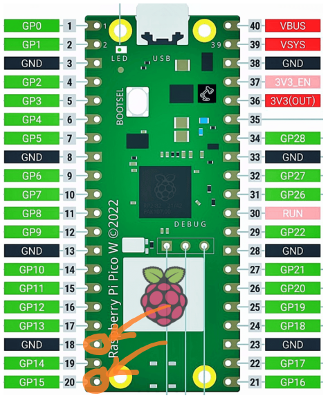

```
         d8b                                                       888 
         Y8P                                                       888 
                                                                   888 
88888b.  888  .d8888b .d88b.  888  888  888 88888b.   .d88b.   .d88888 
888 "88b 888 d88P"   d88""88b 888  888  888 888 "88b d8P  Y8b d88" 888 
888  888 888 888     888  888 888  888  888 888  888 88888888 888  888 
888 d88P 888 Y88b.   Y88..88P Y88b 888 d88P 888  888 Y8b.     Y88b 888 
88888P"  888  "Y8888P "Y88P"   "Y8888888P"  888  888  "Y8888   "Y88888 
888                                                                    
888      You don't know the power of the DARKSIDE!!!!
888
```
# 📡 pic0wn3d 📡
Raspberry Pi Pico W CircuitPython WiFi HID Remote Control

Code is based on **[majdsassi's Pico WIFI Duck](https://github.com/majdsassi/Pico-WIFI-Duck)** ❤️

# 🔥 Includes scripts like 🔥
- PowerShell Persistent shell injector (works with RevShells)
- DNS Poison (PowerShell change DNS, you need to have your own "DNS" server still)
- Change Proxy values
- WiFi keys
- Disable Windows Security
- File Stealer
- Rick Roll ofc...

# 💻 Requirements 💻
- Raspberry Pi Pico W or Pico 2 W (H isn't really needed but _AGGRO mode_ wont work without)
- CircuitPython 9.x (with _adafruit_hid_ & _adafruit_httpserver_)
- _keyboard_layout_win_fi.py_ & _keycode_win_fi.py_ included in the lib directory
- Micro USB cable (hi-speed/data transfer)
- Target
- PC/Phone for remote control via the AP...

# 💥 Features 💥
- Few ready made "_scripts/payloads_"
- This is for **Finnish keyboard layout** (other layouts need few changes in _duck.py_ + the layout libs)
- Two modes: If the jumper wire is on **GPIO15**, "_AGGRO mode_" is on (payload executed instantly) 
- LED behaviour based on status of connected clients
- 1337 h4x **Matrix** web layout so you can **FLEX ON NOOBS!!!** 💪
- Layout is also responsive CSS so usage with phone is easy 👨‍🍼

# ✍️ Installing & Usage ✍️
1. Get the .uf2 and libraries (_adafruit_hid_ & _adafruit_httpserver_): [CircuitPython](https://circuitpython.org/board/raspberry_pi_pico_w/)
2. Initialize the **Pico** by plugging it while pressing **BOOTSEL** button!
3. Drag & drop the CircuitPython .uf2 on the drive
4. Name it **pic0wn3d** (only needed for the premade scripts for file grabbing)
5. Drag & drop files on the root of the drive..
6. Rename the AP and password in _code.py_
7. Use jumper wire for "_AGGRO mode_" (execute payload instantly when plugged) on **GPIO15** 
8. Connect your **Pico** to the PC with a Micro USB cable
9. Use your phone (or whatever) and connect to the AP
10. Open your browser: [192.168.4.1](http://192.168.4.1)
11. Time to **Rick Roll** 😂....
12. Upload wifikeys.ps1 to your server (or use it manually)


---------------------

# 👨‍🔧 Notes.. 👨‍🔧
‼️ If you uncomment _boot.py_ to hide the drive, you can't copy files to the device.

⚠️ I am not responsible for anything anybody does with this code.

⁉️ You may sometimes need to forget the AP (on your phone) if the web page isn't loading.

🚫 When connected to the AP it will announce "_No internet access_", nevermind that.

👌 If you have some nice payload scripts or any suggestions hit me up!

---------------------

🎷 **[youtube.com/flashdancer42](https://www.youtube.com/@flashdancer42)**

📱 **[aurora.oops.wtf](https://aurora.oops.wtf)**

🎹 **[soundcloud.com/siloquez](https://soundcloud.com/siloquez)**

